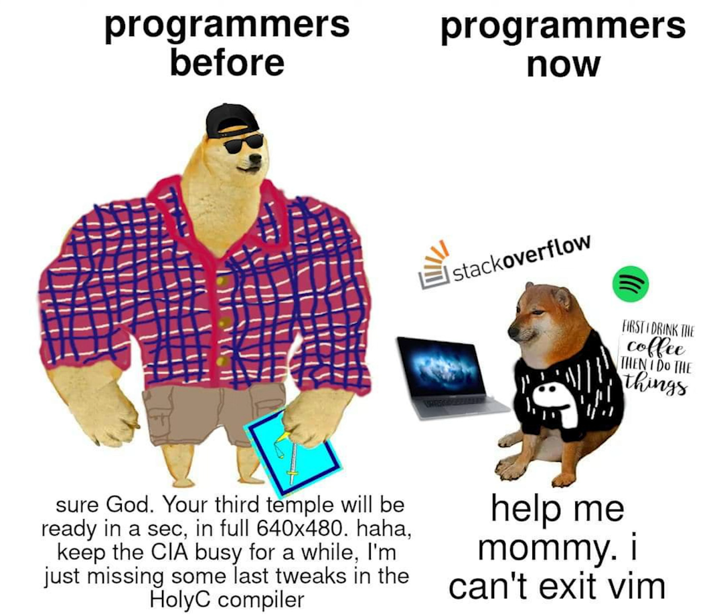

# What is Backtick

Backtick empowers teams to achieve their goals through incorporating reward system with task tracking where members can compete with each other to earn rewards or exclusive crypto coins.

# Credits to the modern programmers

- Ahmad AlAmiri
- Abdullah Almutairi
- Bedour Alrashidi

# Tools Used

- React.
- Tailwind.
- Socket.IO.
- PayPal Gateway.
- Phantom Wallet.
